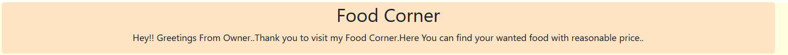
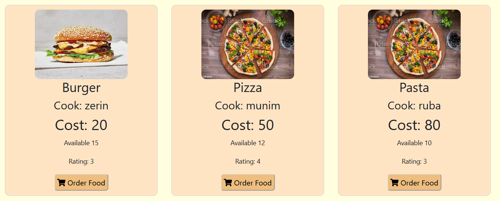
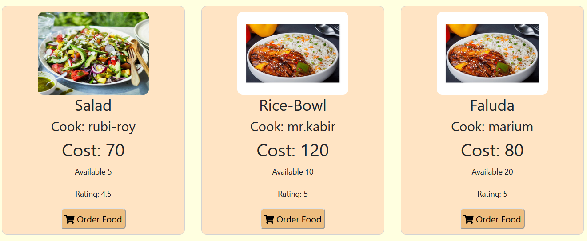
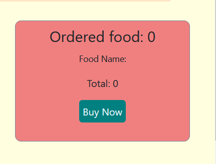

# Food House

This is for those people who wants to buy food in reasonable price.It will be able for added the value of button clicking.Then total price calculate is available here.I will be able to display the 5 thing from my fake data.

[Live Site](https://food-order-misbahmuib.netlify.app/)

##### Footer

##### Customer Reviews

##### CartPage

##### Shipping 

##### Payment

* Here I am using react app.
* created more components to specify my files clearly.
* used the useState and useEffect
* used the arrow functions,for of loop,map etc.

